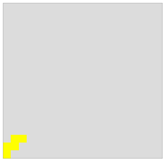

<h1>Block AI</h1>

An AlphaZero Inspired agent to play blockus.


<h2>Overview:</h2>

This project aims to use Convolutional Neural Networks (CNNs) and Monty Carlo Tree Search (MCTS).
As described in the Google Brain Papers on this topic

<h2>Setup:</h2>
This requires the pipenv package


``` bash
# install the pipenv package manager
$ pip install pipenv --deploy

# Installs the python pcakages 
$ pipenv install

# for OSX users set
# Assuming that ~/.matplotlib exists
echo "backend: TkAgg" >> ~/.matplotlib/matplotlibrc

```

Running Tests:
``` bash
$ bash run_tests.sh
```

<h2>Contributers:</h2>
Ben Mitchell  GitHub: BenjaminNMitchell Queens U & Ecobee
Owen Mitchell Github: OwenMitchell

# Blokus Implimentation


```python
from block_ai.lib.myblokus.game_engine import GameEngine
from block_ai.lib.myblokus.game import Game
```


```python
ge = GameEngine()
```

## Plays a random game


```python
ge.play_game()
```

## show the game


```python
ge.game.display()
```


## get the scores for each player


```python
ge.game.get_scores()
```


    {0: 33, 1: 24, 2: 26, 3: 33}


## Moves made in game


```python
ge.game.move_history[:1]
```


    [Move(orientation=Orientation(((2, 0), (1, 0), (0, 0), (1, 1))),
                             player_id=0,
                             piece_id='p8',
                             corner=Corner(p1=(-1, -1), p2=(0, 0)))]


# Working With the Game Object


```python
g = Game()
```


```python
g.display()
```


## Which players turn it is


```python
g.player_pointer
```


    0


## Generate the Moves required for a player


```python
moves = list(g.get_players_moves(0))
```

## Play a move


```python
good_moves = list(filter(lambda m: m.piece_id == "p18", moves))
```


```python
move = good_moves[0]
g.make_move(move)
g.display()
```





```python
g.player_pointer
```


    1


## Unmake a move


```python
g.pop_moves()
g.display()
g.player_pointer
```


    0


